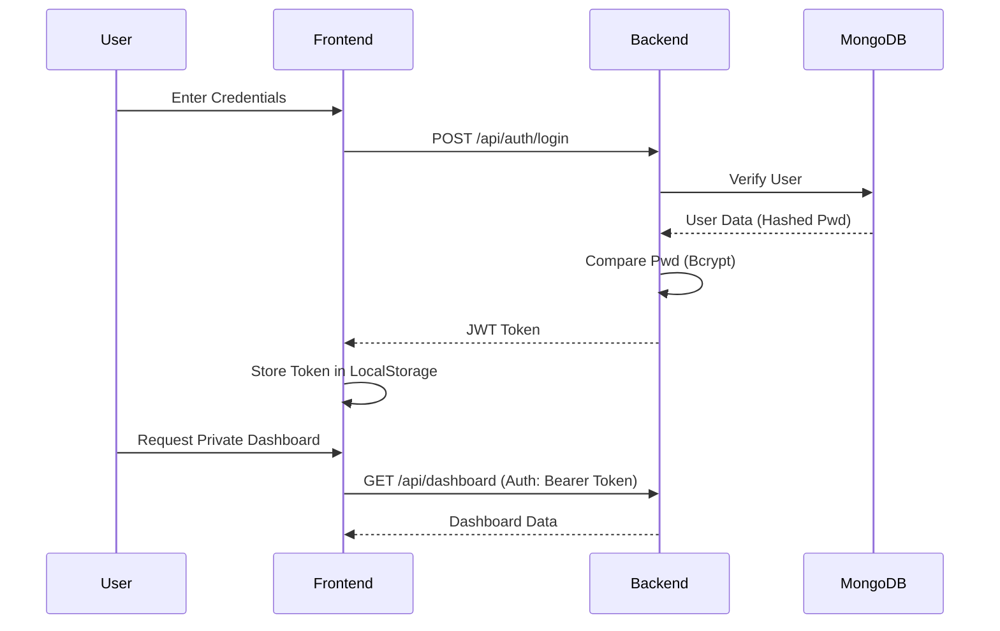

# System Architecture

The FinTech application follows a decoupled client-server architecture using the MERN stack (MongoDB, Express, React, Node.js).

## 📊 High-Level Flow

1.  **Frontend (React)**:
    -   State management using React Hooks (`useState`, `useEffect`).
    -   Routing via `react-router-dom`.
    -   Data visualization with `recharts`.
    -   API requests handled through `axios`.

2.  **API Gateway / Backend (Express)**:
    -   Secure endpoints protected by JWT middleware.
    -   Data validation using `express-validator`.
    -   File uploads managed by `multer`.

3.  **Data Layer (MongoDB & Mongoose)**:
    -   Schema-based modeling for Expenses, Vendors, and Users.
    -   Mongoose hooks for password hashing (Bcrypt).

## 🔄 User Authentication Flow

## 📈 Reporting Pipeline

-   Data is aggregated from MongoDB using Mongoose aggregate.
-   Aggregated results are sent to the frontend for visualization.
-   Users can export data to **CSV (xlsx)** or **PDF (jspdf)** using client-side utilities.
